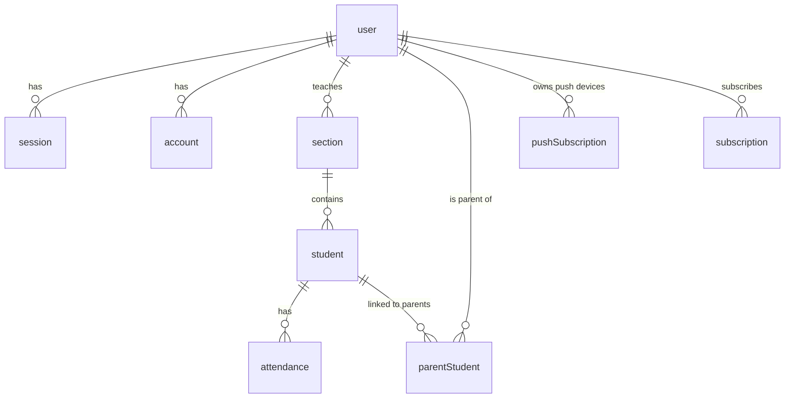

# QR Attendnz — System Design

## Project Overview

QR Attendnz is a QR-code-based attendance tracking system. Teachers create sections (classes), add students, and mark daily attendance (time-in/time-out). Parents can join sections via a class code, link themselves to their children's records, and receive Web Push notifications when attendance is recorded.

The backend is a RESTful API built with ElysiaJS, using better-auth for authentication and Drizzle ORM on PostgreSQL (Neon Serverless).

---

## Technology Stack

| Layer       | Technology                 | Purpose                                           |
| ----------- | --------------------------| ------------------------------------------------- |
| Runtime     | **Bun**                   | JavaScript runtime & package manager              |
| Framework   | **ElysiaJS**              | Type-safe HTTP framework + built-in WebSocket     |
| Auth        | **better-auth**           | Session-based auth with email/password + username |
| ORM         | **Drizzle ORM**           | Type-safe SQL ORM for PostgreSQL                  |
| Database    | **Neon (PostgreSQL)**     | Serverless Postgres                               |
| Real-time   | **ElysiaWS (built-in)**   | WebSocket for realtime attendance push            |
| Push        | **web-push**              | Web Push API (VAPID) notifications                |
| Validation  | **Elysia `t`**            | Runtime request/response validation               |
| Env         | **dotenvx**               | Encrypted environment variable management         |
| CORS        | **@elysiajs/cors**        | Cross-origin support                              |
| Docs        | **@elysiajs/openapi**     | OpenAPI/Swagger documentation                     |

---

## Directory Structure

```
backend/
├── .agents/skills/elysiajs/       # IDE skill configuration
├── .env.dev                       # Encrypted dev environment
├── .env.prod                      # Encrypted production environment
├── .env.keys                      # Decryption keys (gitignored)
├── AGENTS.md                      # Agent conventions
├── SYSTEM-DESIGN.md               # This file
├── drizzle/
│   ├── index.ts                   # DB client singleton (Pool + Drizzle ORM)
│   ├── migrations/                # SQL migration files (Drizzle Kit)
│   └── schema/                    # Database schema definitions
│       ├── index.ts               # Re-exports all schema modules
│       ├── auth-schema.ts         # user, session, account, verification
│       ├── attendance.ts          # Attendance records
│       ├── device.ts              # PushSubscription table
│       ├── enums.ts               # roleEnum, genderEnum
│       ├── parent-student.ts      # Parent-student join table
│       ├── section.ts             # Section (class) table
│       └── student.ts             # Student table
├── env.ts                         # Zod-validated environment schema
├── package.json
├── tsconfig.json
└── src/
    ├── index.ts                   # App entry point
    ├── routes.ts                  # Route aggregator (api/v1 prefix)
    ├── auth/
    │   ├── controller.ts          # authPlugin (session guard macro + OpenAPI helper)
    │   ├── service.ts             # better-auth initialization
    │   └── model.ts               # Re-exports
    ├── sections/
    │   ├── controller.ts          # GET/POST /sections
    │   ├── service.ts             # sectionService
    │   └── model.ts               # Validation schemas
    ├── students/
    │   ├── controller.ts          # POST /sections/:sectionId/students
    │   ├── service.ts             # studentService
    │   └── model.ts               # Validation schemas
    ├── attendance/
    │   ├── controller.ts          # POST /attendance/time-in, /attendance/time-out
    │   ├── service.ts             # attendanceService
    │   ├── model.ts               # Validation schemas
    │   └── push-sender.ts         # Web Push notification dispatcher
    ├── parent/
    │   ├── controller.ts          # POST /parent/join, /parent/students
    │   ├── service.ts             # parentService
    │   └── model.ts               # Validation schemas
    ├── subscription/
    │   ├── controller.ts          # POST /subscription/create-invoice, webhook, status, cancel
    │   ├── service.ts             # Xendit subscription management
    │   └── model.ts               # Validation schemas
    ├── plans/
    │   └── service.ts             # Feature flag checks, plan utilities
    └── push/
        ├── controller.ts          # GET/POST/DELETE /subscriptions
        ├── service.ts             # pushService
        └── model.ts               # Validation schemas
    └── ws/
        ├── handler.ts             # WebSocket route (/ws) with session-based auth
        └── pubsub.ts              # User-scoped pub/sub registry for broadcasting
```

---

## System Architecture

```
┌──────────────┐     HTTP/WS   ┌──────────────────────────────────────────┐
│   Frontend   │ ──────────▶   │         Bun HTTP/WS Server               │
│  (React/??)  │ ◀──────────   │          (port 8080)                     │
└──────────────┘               │              │                           │
                               │         ┌────┴────┐                      │
                               │         │  CORS   │    WebSocket         │
                               │         └────┬────┘    (ws:///ws)        │
                               │              │            │              │
                               │              ▼            ▼              │
                               │    ┌────────────────┐ ┌──────────┐       │
                               │    │ Elysia Router  │ │ WS Auth  │       │
                               │    └──┬─────┬──────┬┘ │(session) │       │
                               │       │     │      │  └────┬─────┘       │
                               │       ▼     ▼      ▼       │             │
                               │   GET /  /auth/*  /api/v1/* │             │
                               │  (health) (better-  (apiRts) │            │
                               │            auth)      │     │            │
                               │                  authPlugin │             │
                               │                (session guard)│           │
                               │                    │        │             │
                               │              ┌────▼──┐  ┌──▼─────────┐  │
                               │              │Control│  │  pubsub.ts  │  │
                               │              │(route)│  │(broadcast)  │  │
                               │              └────┬──┘  └──────┬──────┘  │
                               │                   │            │         │
                               │              ┌────▼──────┐    │         │
                               │              │  Service  │◄───┘         │
                               │              │ (business │              │
                               │              │  logic)   │              │
                               │              └──┬────┬───┘              │
                               │                 │    │                  │
                               │                 ▼    ▼                  │
                               │         Drizzle ORM  web-push           │
                               │                 │                       │
                               └─────────────────┼───────────────────────┘
                                                  │
                                          ┌───────▼────────┐
                                          │   PostgreSQL    │
                                          │  (Neon Server-  │
                                          │    less)        │
                                          └────────────────┘
```

---

## Request Flow

### HTTP Request Flow

1. **HTTP Request** arrives at Bun HTTP Server (port 8080).
2. **CORS middleware** (`@elysiajs/cors`) adds CORS headers — origin `http://localhost:3001`, credentials enabled.
3. **Elysia Router** matches the path:
   - `GET /` → health check response (`"Hello Elysia"`).
   - `/auth/*` → forwarded to **better-auth** handler (`.mount(auth.handler)`). Handles sign-up, sign-in, session, etc. Uses Drizzle adapter for DB.
   - `/api/v1/*` → forwarded to `apiRoutes` (Elysia plugin with `prefix: "api/v1"`).
4. **authPlugin macro** fires on routes with `{ auth: true }`:
   - Calls `auth.api.getSession({ headers })` to validate the session cookie/token.
   - No valid session → returns `401 Unauthorized`.
   - Valid session → injects `{ session }` into the handler context.
5. **teacherGuard plugin** (`.derive`) extracts `isTeacher` and `userPlan` from the session for downstream use.
6. **Route handler** (controller) runs:
   - **Role check**: handler checks `session.user.role.includes("teacher")` — supports multi-role users.
   - **Plan check**: teacher routes also verify `session.user.plan !== "free"` — teachers must have Essential or Premium.
   - **Service method** called: performs business logic via Drizzle ORM queries against Neon PostgreSQL.
   - **Push notification** (optional): attendance service calls `sendPushToParent()` → `web-push` dispatches to parent browsers.
   - **WebSocket broadcast** (optional): attendance/student services call `broadcastToUsers()` → pushes realtime update to connected WS clients.
7. **JSON response** returned.

### WebSocket Flow

1. **Client** opens `new WebSocket("ws://host/ws")` (uses same-origin cookies for auth).
2. **Elysia `ws()` handler** receives the upgrade request and calls `open(ws)`.
3. **Session auth**: the handler calls `auth.api.getSession({ headers })` using the upgrade request's `Cookie` header.
   - No valid session → `ws.close()` immediately.
   - Valid session → `ws.data.userId` is set, user is `subscribe()`d to the pub/sub registry.
4. **Keepalive**: client sends `{ type: "ping" }` → server responds `{ type: "pong" }`.
5. **Realtime updates** (server → client, pushed as JSON):
   - `{ type: "attendance:updated", studentId, timeIn, timeOut, date }` — sent when a teacher marks time-in/time-out. Recipients: the teacher who performed the action + all parents linked to that student.

6. **Disconnect**: `close` handler calls `unsubscribe()` to remove the connection from the pub/sub registry. Client auto-reconnects with exponential backoff (1s → 30s max).

### Pub/Sub Architecture

```
attendanceService         broadcastToUsers([teacherId, ...parentIds], message)
       │                                │
       │                                ▼
       │                     ┌──────────────────┐
       │                     │   pubsub.ts      │
       │                     │  Map<userId,     │
       │                     │   Set<ElysiaWS>> │
       │                     └──────┬───┬───────┘
       │                            │   │
       ▼                            ▼   ▼
  Web Push                    ┌──────────────┐
  (push-sender.ts)            │  ws handler  │
                              │  per-user    │
                              │  ElysiaWS    │
                              └──────────────┘
                                    │
                                    ▼
                              Client Browser

---

## Authentication & Authorization

### better-auth Configuration (`src/auth/service.ts`)

| Setting          | Value                                           |
| ---------------- | ----------------------------------------------- |
| Auth method      | Email/password + username plugin                |
| Password hashing | `Bun.password.hash()` / `Bun.password.verify()` |
| Session expiry   | 7 days                                          |
| Cookie cache     | 5 minutes (performance)                         |
| DB adapter       | Drizzle ORM (PostgreSQL)                        |
| User ID strategy | Database serial (auto-increment)                |

### Session Guard Macro (`src/auth/controller.ts`)

A custom Elysia macro named `auth` is defined on the `authPlugin`. Any route with `{ auth: true }` runs the macro's `resolve` function before the handler:

```typescript
.macro({
  auth: {
    async resolve({ request: { headers }, set }) {
      const session = await auth.api.getSession({ headers });
      if (!session) { set.status = 401; return; }
      return { session };
    },
  },
})
```

### Role-Based Authorization

The `role` field is stored on the `user` table as a `text[]` array (default: `["parent"]`). Users can have one or both roles. Role checks use `session.user.role.includes("teacher")`.

Teachers are **required** to have a paid plan (`essential` or `premium`) to access teacher endpoints. Users with `plan: "free"` who also have `role: ["teacher"]` are blocked from teacher actions until they subscribe.

#### Plan Feature Matrix

| Feature Key                     | Free | Essential | Premium |
| ------------------------------- | ---- | --------- | ------- |
| `attendance_download_csv`       | ✅   | ✅        | ✅      |
| `attendance_download_xlsx`      | ✅   | ✅        | ✅      |
| `attendance_view_yesterday`     | ❌   | ✅        | ✅      |
| `attendance_download_yesterday` | ❌   | ✅        | ✅      |
| `attendance_download_pdf`       | ❌   | ❌        | ✅      |
| `attendance_weekly_report`      | ❌   | ❌        | ✅      |
| `attendance_monthly_report`     | ❌   | ❌        | ✅      |
| `attendance_analytics`          | ❌   | ❌        | ✅      |
| `custom_qr_card`                | ❌   | ❌        | ✅      |
| `bulk_student_import`           | ❌   | ❌        | ✅      |
| `sms_notification`              | ❌   | ❌        | ⏳      |

#### Roles Table

| Role                | Default              | Plan Required | Authorized Actions                                                                  |
| ------------------- | -------------------- | ------------- | ----------------------------------------------------------------------------------- |
| `teacher`           | No                   | Essential+    | Create sections, add students, mark time-in/time-out, view sections with attendance |
| `parent`            | **Yes** (default)    | Free          | Join sections via class code, link to students, receive push notifications          |
| any (authenticated) | —                    | —             | Auth flows (sign-up/sign-in/out), manage own push subscriptions                     |

#### Authorization Matrix

| Endpoint                                 | Auth Required | Role Required | Plan Required | Access Denied          |
| ---------------------------------------- | ------------- | ------------- | ------------- | ---------------------- |
| `POST /auth/*` (sign-up, sign-in)        | No            | None          | —             | —                      |
| `POST /auth/*` (session, sign-out, etc.) | Yes           | None          | —             | 401 if invalid session |
| `GET /sections`                          | Yes           | `teacher`     | Essential+    | 403                    |
| `POST /sections`                         | Yes           | `teacher`     | Essential+    | 403                    |
| `POST /sections/:sectionId/students`     | Yes           | `teacher`     | Essential+    | 403                    |
| `POST /attendance/time-in`               | Yes           | `teacher`     | Essential+    | 403                    |
| `POST /attendance/time-out`              | Yes           | `teacher`     | Essential+    | 403                    |
| `POST /parent/join`                      | Yes           | any           | —             | —                      |
| `POST /parent/students`                  | Yes           | any           | —             | —                      |
| `GET /subscriptions`                     | Yes           | any           | —             | —                      |
| `POST /subscriptions`                    | Yes           | any           | —             | —                      |
| `DELETE /subscriptions/:id`              | Yes           | any           | —             | —                      |
| `POST /subscription/create-invoice`      | Yes           | any           | —             | —                      |
| `GET /subscription/status`               | Yes           | any           | —             | —                      |
| `POST /subscription/cancel`              | Yes           | any           | —             | —                      |
| `POST /subscription/webhook`             | No            | None          | —             | —                      |

---

## Database Schema

### Entity Relationship Diagram



### Tables

#### `user` (better-auth extended)

| Column        | Type      | Constraints                     | Notes                                    |
| ------------- | --------- | ------------------------------- | ---------------------------------------- |
| id            | serial    | PK                              |                                          |
| name          | text      | NOT NULL                        |                                          |
| email         | text      | NOT NULL, UNIQUE                |                                          |
| emailVerified | boolean   | DEFAULT false                   |                                          |
| image         | text      | nullable                        |                                          |
| username      | text      | UNIQUE                          | from username plugin                     |
| role          | text[]    | NOT NULL, DEFAULT `['parent']`  | Array: `['teacher']`, `['parent']`, both |
| plan          | text      | NOT NULL, DEFAULT `'free'`      | `free`, `essential`, or `premium`        |
| createdAt     | timestamp | DEFAULT now()                   |                                          |
| updatedAt     | timestamp | DEFAULT now()                   | auto-updated                             |

#### `session` (better-auth)

| Column    | Type                  | Constraints       |
| --------- | --------------------- | ----------------- |
| id        | serial                | PK                |
| expiresAt | timestamp             | NOT NULL          |
| token     | text                  | NOT NULL, UNIQUE  |
| userId    | serial (FK → user.id) | NOT NULL, CASCADE |
| ipAddress | text                  | nullable          |
| userAgent | text                  | nullable          |
| createdAt | timestamp             | DEFAULT now()     |
| updatedAt | timestamp             | auto-updated      |

#### `account` (better-auth)

| Column       | Type                  | Constraints       |
| ------------ | --------------------- | ----------------- |
| id           | serial                | PK                |
| accountId    | text                  | NOT NULL          |
| providerId   | text                  | NOT NULL          |
| userId       | serial (FK → user.id) | NOT NULL, CASCADE |
| accessToken  | text                  | nullable          |
| refreshToken | text                  | nullable          |
| idToken      | text                  | nullable          |
| password     | text                  | nullable (hashed) |
| scope        | text                  | nullable          |
| createdAt    | timestamp             | DEFAULT now()     |
| updatedAt    | timestamp             | auto-updated      |

#### `verification` (better-auth)

| Column     | Type      | Constraints   |
| ---------- | --------- | ------------- |
| id         | serial    | PK            |
| identifier | text      | NOT NULL      |
| value      | text      | NOT NULL      |
| expiresAt  | timestamp | NOT NULL      |
| createdAt  | timestamp | DEFAULT now() |
| updatedAt  | timestamp | auto-updated  |

#### `Section`

| Column    | Type                  | Constraints       | Notes                       |
| --------- | --------------------- | ----------------- | --------------------------- |
| id        | serial                | PK                |                             |
| name      | text                  | NOT NULL          | e.g. "Grade 3 - Sampaguita" |
| classCode | text                  | NOT NULL, UNIQUE  | Parent join code            |
| teacherId | serial (FK → user.id) | NOT NULL, CASCADE | Tenant boundary             |
| createdAt | timestamp             | DEFAULT now()     |                             |

#### `Student`

| Column    | Type                      | Constraints       | Notes                        |
| --------- | ------------------------- | ----------------- | ---------------------------- |
| id        | serial                    | PK                |                              |
| name      | text                      | NOT NULL          | Student display name         |
| gender    | genderEnum                | NOT NULL          | `male`, `female`, or `other` |
| sectionId | integer (FK → section.id) | NOT NULL, CASCADE |                              |

#### `Attendance`

| Column    | Type                      | Constraints       | Notes           |
| --------- | ------------------------- | ----------------- | --------------- |
| id        | serial                    | PK                |                 |
| studentId | integer (FK → student.id) | NOT NULL, CASCADE |                 |
| date      | date                      | NOT NULL          |                 |
| timeIn    | timestamp                 | nullable          | Set on time-in  |
| timeOut   | timestamp                 | nullable          | Set on time-out |

**Unique constraint**: `(studentId, date)` — one record per student per day.

#### `ParentStudent`

| Column    | Type                     | Constraints                             |
| --------- | ------------------------ | --------------------------------------- |
| parentId  | serial (FK → user.id)    | NOT NULL, CASCADE, part of composite PK |
| studentId | serial (FK → student.id) | NOT NULL, CASCADE, part of composite PK |

**PK**: `(parentId, studentId)` — many-to-many join table.

#### `PushSubscription`

| Column      | Type                  | Constraints       | Notes                                              |
| ----------- | --------------------- | ----------------- | -------------------------------------------------- |
| id          | serial                | PK                |                                                    |
| userId      | serial (FK → user.id) | NOT NULL, CASCADE |                                                    |
| endpoint    | text                  | NOT NULL, UNIQUE  | Web Push endpoint URL                              |
| keys        | json                  | NOT NULL          | `{ p256dh, auth }`                                 |
| browserInfo | json                  | DEFAULT `{}`      | `{ userAgent, browser, version, os, deviceType? }` |
| createdAt   | timestamp             | DEFAULT now()     |                                                    |

#### `PlanFeature`

| Column      | Type      | Constraints                          | Notes                                           |
| ----------- | --------- | ------------------------------------ | ----------------------------------------------- |
| id          | serial    | PK                                   |                                                 |
| plan        | text      | NOT NULL                             | `free`, `essential`, or `premium`               |
| featureKey  | text      | NOT NULL                             | e.g. `attendance_download_csv`                  |
| isEnabled   | boolean   | DEFAULT true                         |                                                 |
| config      | jsonb     | DEFAULT `{}`                         | Extra config (limits, quotas, etc.)             |
| createdAt   | timestamp | DEFAULT now()                        |                                                 |
| updatedAt   | timestamp | DEFAULT now()                        | auto-updated                                    |

**Unique constraint**: `(plan, featureKey)`

#### `Subscription`

| Column               | Type                  | Constraints       | Notes                                    |
| -------------------- | --------------------- | ----------------- | ---------------------------------------- |
| id                   | serial                | PK                |                                          |
| userId               | serial (FK → user.id) | NOT NULL, CASCADE | One subscription per user                |
| plan                 | text                  | NOT NULL          | `essential` or `premium`                 |
| status               | text                  | DEFAULT inactive  | `active`, `inactive`, `cancelled`, `expired`, `trialing`, `pending`, `failed` |
| provider             | text                  | DEFAULT `paymongo`| Payment provider (`paymongo`)            |
| providerLinkId       | text                  | nullable          | PayMongo link ID (`link_abc`)            |
| providerPaymentId    | text                  | nullable          | PayMongo payment ID (`pay_abc`)          |
| currentPeriodStart   | timestamp             | nullable          | Billing period start                     |
| currentPeriodEnd     | timestamp             | nullable          | Billing period end                       |
| trialEndsAt          | timestamp             | nullable          | Trial expiration                         |
| cancelledAt          | timestamp             | nullable          | When cancelled                           |
| createdAt            | timestamp             | DEFAULT now()     |                                          |
| updatedAt            | timestamp             | DEFAULT now()     | auto-updated                             |

**Unique constraint**: `(userId)` — one subscription per user.

### Enums

```typescript
roleEnum = pgEnum("role", ["teacher", "parent"]);
genderEnum = pgEnum("gender", ["male", "female", "other"]);
userPlanEnum = pgEnum("user_plan", ["free", "essential", "premium"]);
subscriptionStatusEnum = pgEnum("subscription_status", [
  "active", "inactive", "cancelled", "expired", "trialing",
]);
```

---

## API Endpoints

All routes under `/api/v1/*` require authentication (session cookie/token) unless noted. The auth macro automatically returns `401` for unauthenticated requests.

### WebSocket — `{base}/ws`

| Protocol   | Path | Auth | Description                                                    |
| ---------- | ---- | ---- | -------------------------------------------------------------- |
| WebSocket  | /ws  | Yes  | Session-based auth via upgrade cookie. Pushes `attendance:updated` events in realtime. |

**Server → Client messages:**
```typescript
// Attendance was marked
{ type: "attendance:updated", studentId: number, timeIn: string|null, timeOut: string|null, date: string }


```

**Client → Server messages:**
```typescript
// Keepalive ping
{ type: "ping" }
```

### Auth — `{base}/api/v1/auth/*`

These routes are generated by better-auth. Paths are remapped from `/auth/*` to `/api/v1/auth/*` in the OpenAPI documentation.

| Method | Path                          | Auth | Description                    |
| ------ | ----------------------------- | ---- | ------------------------------ |
| POST   | /auth/sign-up                 | No   | Register with email + password |
| POST   | /auth/sign-in                 | No   | Login with email + password    |
| POST   | /auth/sign-out                | Yes  | Logout                         |
| GET    | /auth/session                 | Yes  | Get current session            |
| GET    | /auth/list-sessions           | Yes  | List active sessions           |
| POST   | /auth/update-user             | Yes  | Update profile                 |
| POST   | /auth/change-password         | Yes  | Change password                |
| POST   | /auth/forget-password         | No   | Send password reset email      |
| POST   | /auth/reset-password          | No   | Reset password with token      |
| POST   | /auth/send-verification-email | Yes  | Send email verification        |
| POST   | /auth/verify-email            | No   | Confirm verification token     |

### Sections — `{base}/api/v1/sections`

| Method | Path      | Auth | Role    | Description                                                                                |
| ------ | --------- | ---- | ------- | ------------------------------------------------------------------------------------------ |
| GET    | /sections | Yes  | teacher | List teacher's sections with students and today's attendance. Optional `?date=YYYY-MM-DD`. |
| POST   | /sections | Yes  | teacher | Create a new section. Body: `{ name, classCode }`.                                         |

### Students — `{base}/api/v1/sections/:sectionId/students`

| Method | Path                          | Auth | Role    | Description                                                            |
| ------ | ----------------------------- | ---- | ------- | ---------------------------------------------------------------------- |
| POST   | /sections/:sectionId/students | Yes  | teacher | Add a student. Body: `{ name, gender }`. Auto-links teacher as parent. |

### Attendance — `{base}/api/v1/attendance`

| Method | Path                 | Auth | Role    | Description                                                                       |
| ------ | -------------------- | ---- | ------- | --------------------------------------------------------------------------------- |
| POST   | /attendance/time-in  | Yes  | teacher | Mark student arrived. Body: `{ studentId }`. Sends push to parents.               |
| POST   | /attendance/time-out | Yes  | teacher | Mark student departed. Body: `{ studentId }`. Requires prior time-in. Sends push. |

### Parent — `{base}/api/v1/parent`

| Method | Path             | Auth | Role | Description                                                                       |
| ------ | ---------------- | ---- | ---- | --------------------------------------------------------------------------------- |
| POST   | /parent/join     | Yes  | any  | Look up section by class code. Body: `{ classCode }`. Returns section + students. |
| POST   | /parent/students | Yes  | any  | Link current user to students. Body: `{ studentIds: number[] }`.                  |

### Push Subscriptions — `{base}/api/v1/subscriptions`

| Method | Path               | Auth | Role | Description                                                        |
| ------ | ------------------ | ---- | ---- | ------------------------------------------------------------------ |
| GET    | /subscriptions     | Yes  | any  | List push subscriptions for current user.                          |
| POST   | /subscriptions     | Yes  | any  | Register a subscription. Body: `{ endpoint, keys, browserInfo? }`. |
| DELETE | /subscriptions/:id | Yes  | any  | Remove a subscription.                                             |

### Subscription — `{base}/api/v1/subscription`

| Method | Path                       | Auth | Role | Description                                                         |
| ------ | -------------------------- | ---- | ---- | ------------------------------------------------------------------- |
| POST   | /subscription/create-invoice | Yes  | any  | Create PayMongo payment link. Body: `{ plan }`. Returns `{ checkoutUrl, linkId }`. |
| POST   | /subscription/webhook      | No   | none | PayMongo webhook for `link.payment.paid` / `link.payment.failed`. HMAC-SHA256 verified. |
| GET    | /subscription/status       | Yes  | any  | Get current subscription status and billing periods.                |
| POST   | /subscription/cancel       | Yes  | any  | Cancel active subscription, revert plan to free.                    |

---

## Service Layer

### `sectionService` (`src/sections/service.ts`)

| Method                                          | Description                                                                                                          |
| ----------------------------------------------- | -------------------------------------------------------------------------------------------------------------------- |
| `createSection({ name, classCode, teacherId })` | Creates a new section owned by the teacher.                                                                          |
| `getTeacherSections(teacherId, date?)`          | Fetches all sections for a teacher with nested students and their attendance for the given date (defaults to today). |

### `studentService` (`src/students/service.ts`)

| Method                                                  | Description                                                                                                      |
| ------------------------------------------------------- | ---------------------------------------------------------------------------------------------------------------- |
| `createStudent({ name, gender, sectionId, teacherId })` | Verifies section ownership, inserts student, and auto-creates a `ParentStudent` link with the teacher as parent. |

### `attendanceService` (`src/attendance/service.ts`)

| Method                              | Description                                                                                                                                                 |
| ----------------------------------- | ----------------------------------------------------------------------------------------------------------------------------------------------------------- |
| `markTimeIn(studentId, teacherId)`  | Validates student existence and teacher ownership. Upserts an attendance record for today with `timeIn = now()`. Sends push notification to linked parents. |
| `markTimeOut(studentId, teacherId)` | Same ownership check. Requires existing `timeIn` for today. Sets `timeOut = now()`. Sends push notification.                                                |

### `parentService` (`src/parent/service.ts`)

| Method                               | Description                                                                   |
| ------------------------------------ | ----------------------------------------------------------------------------- |
| `getStudentsByClassCode(classCode)`  | Looks up a section by class code and returns its student list.                |
| `linkStudents(parentId, studentIds)` | Links a parent to students via `ParentStudent`, deduplicating existing links. |

### `pushService` (`src/push/service.ts`)

| Method                                           | Description                                                 |
| ------------------------------------------------ | ----------------------------------------------------------- |
| `register(userId, endpoint, keys, browserInfo?)` | Upserts a push subscription (matches on endpoint).          |
| `unregister(userId, id)`                         | Deletes a subscription only if it belongs to the user.      |
| `list(userId)`                                   | Lists all subscriptions for the user.                       |
| `getSubscriptionsByParentId(parentId)`           | Retrieves subscriptions by parent ID (used by push sender). |

### `planService` (`src/plans/service.ts`)

| Method                                     | Description                                                                   |
| ------------------------------------------ | ----------------------------------------------------------------------------- |
| `meetsMinimumPlan(userPlan, minimum)`      | Checks if `userPlan` >= `minimum` using hierarchy (`free` < `essential` < `premium`). |
| `hasFeatureAccess(userPlan, featureKey)`   | Queries `plan_feature` table to check if a feature is enabled for the plan.   |
| `getEnabledFeatures(userPlan)`             | Returns all enabled feature keys for a given plan.                            |

### `pubsub` (`src/ws/pubsub.ts`)

| Function                                   | Description                                                                                   |
| ------------------------------------------ | --------------------------------------------------------------------------------------------- |
| `subscribe(userId, ws)`                    | Registers a WebSocket connection for a user. Multiple connections per user = multiple tabs.   |
| `unsubscribe(userId, ws)`                  | Removes a specific WebSocket connection.                                                      |
| `broadcastToUsers(userIds, message)`       | Sends a JSON message to all open WebSocket connections for the given user IDs (teacher + parents). |

### `subscriptionService` (`src/subscription/service.ts`)

| Method                                                   | Description                                                            |
| -------------------------------------------------------- | ---------------------------------------------------------------------- |
| `createInvoice(userId, plan, payerEmail?)`                | Creates PayMongo payment link via `POST /v1/links`, upserts subscription row as `pending`. |
| `handleLinkPaymentPaid(linkId, paymentId)`               | Activates subscription, sets `plan` on user, records 30-day billing period. |
| `handleLinkPaymentFailed(linkId)`                        | Marks subscription as `failed`.                                        |
| `getStatus(userId)`                                      | Returns current subscription info (plan, status, periods).             |
| `cancelSubscription(userId)`                             | Sets subscription to `cancelled`, reverts user's plan to `free`.        |
| `checkAndExpireStaleSubscriptions()`                     | Background task: expires subscriptions past `currentPeriodEnd`.        |
| `verifyWebhookSignature(rawBody, signatureHeader)`       | Verifies HMAC-SHA256 signature from PayMongo `webhook-signature` header.|

---

## Push Notification Flow

```
Teacher marks time-in/time-out
          │
          ▼
attendanceService.markTimeIn/markTimeOut()
          │
          ▼
sendPushToParent(studentId, studentName, type)
          │
          ├── 1. Query ParentStudent for linked parent IDs
          ├── 2. For each parentId → query PushSubscription
          ├── 3. For each subscription → web-push.sendNotification()
          │
          ├── Success → done
          │
          └── Error (410 Gone / 404 Not Found)
                    │
                    ▼
               Delete stale subscription
               (endpoint no longer valid)
```

The push notification payload:

| Field | Time-In                  | Time-Out                 |
| ----- | ------------------------ | ------------------------ |
| title | "Present"                | "Checked Out"            |
| body  | "{name} is now present"  | "{name} has checked out" |
| icon  | `/icon.png`              | `/icon.png`              |
| tag   | `attendance-{studentId}` | `attendance-{studentId}` |

---

## OpenAPI Integration

Two OpenAPI sources are merged in `src/index.ts`:

1. **Elysia's built-in schema**: auto-generated from route definitions (tags, params, body, response schemas).
2. **better-auth's `openAPI()` plugin**: generates schemas for all auth routes. Paths are remapped from `/auth/*` to `/api/v1/auth/*` and tagged `"Better Auth"` via `src/auth/controller.ts`.

The OpenAPI UI is served at the Elysia OpenAPI endpoint (typically `/swagger` or `/reference`).

---

## Environment Variables

| Variable                 | Description                                   |
| ------------------------ | --------------------------------------------- |
| `DATABASE_URL`           | PostgreSQL connection string (Neon)           |
| `BETTER_AUTH_SECRET`     | Auth signing secret                           |
| `BETTER_AUTH_URL`        | Base URL for the auth service                 |
| `FRONTEND_URL`           | Frontend base URL for payment redirects + CORS|
| `VAPID_PUBLIC_KEY`       | Web Push VAPID public key                     |
| `VAPID_PRIVATE_KEY`      | Web Push VAPID private key                    |
| `VAPID_EMAIL`            | Contact email for VAPID                       |
| `PAYMONGO_SECRET_KEY`    | PayMongo secret API key                       |
| `PAYMONGO_WEBHOOK_SECRET`| PayMongo webhook signing secret (HMAC-SHA256) |

Env files are encrypted with dotenvx. `.env.dev` for development, `.env.prod` for production.

---

## Scripts

| Script        | Command                                                                                |
| ------------- | -------------------------------------------------------------------------------------- |
| `dev`         | `dotenvx run -f .env.dev -- bun run --watch src/index.ts`                              |
| `build`       | `dotenvx run -f .env.prod -- bun build src/index.ts --compile --outfile ./dist/server` |
| `env:ec`      | `bunx dotenvx encrypt -f` (encrypt env file)                                           |
| `env:dc`      | `bunx dotenvx decrypt -f` (decrypt env file)                                           |
| `db:dev-gen`  | Generate Drizzle migrations from schema                                                |
| `db:dev-push` | Push schema to dev DB                                                                  |
| `db:dev-mig`  | Run migrations on dev DB                                                               |
| `db:dev-view` | Open Drizzle Studio (GUI)                                                              |
